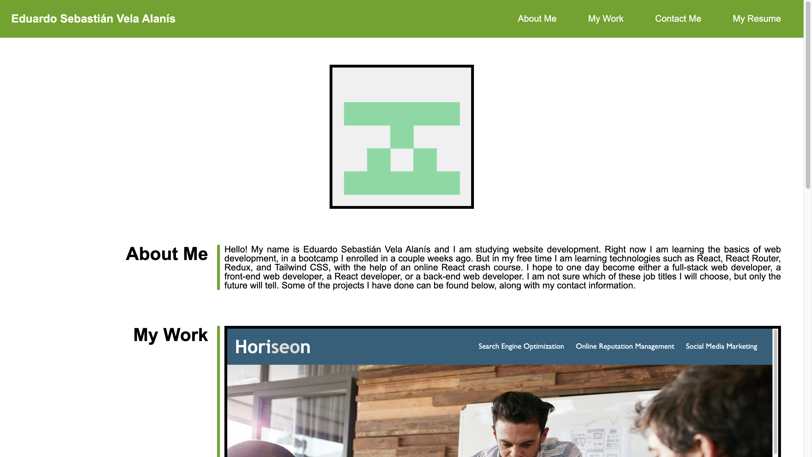
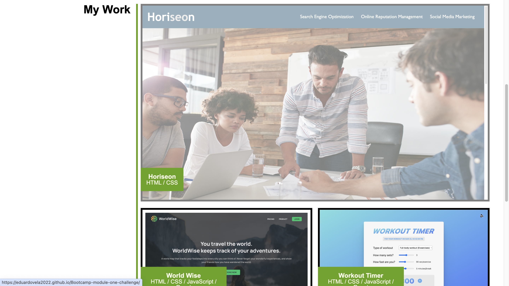

# Bootcamp module two challenge

## Description

The reason I created this project was to practice the HTML and CSS programing languages. This challenge was great practice, since no starter code was given and I had to create all the files this project uses. One of the great features of this project is that it has a responsive layout, so no matter the screen size of the device it is rendered on, the website will display its content in a user friendly way. Another feature worth mentioning is that this project uses CSS flex box to align most of its elements, which helped me achieve the layout of the website.

## Installation

No installation is required. You can access the website by using the following link: https://eduardovela2022.github.io/Bootcamp-module-two-challenge/

## Usage

- When you open the website you can navigate to its various sections, by using the navigation bar in its header, or you can scroll downwards to find them.

- When you click on one of the projects of the “My Work” section, the website will redirect you to their website. For example, when you click on the Horiseon project, you will be redirected to the Horiseon webpage.

## Credits

Most of the projects I show in the “My Work” section of the website are from a React crash course of Jonas Schmedtmann, so I am giving him the credits, since he the original creator of the projects. Here is a link to his crash course: https://www.udemy.com/course/the-ultimate-react-course/

## License

This project uses the MIT license.
